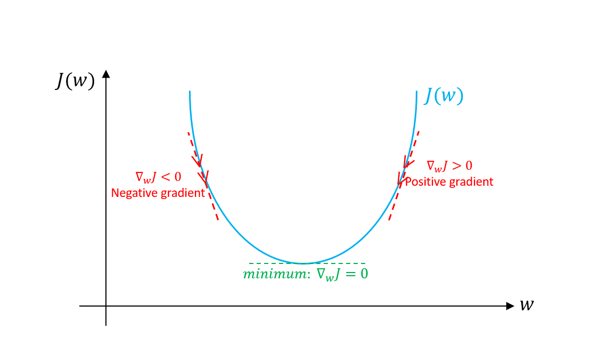
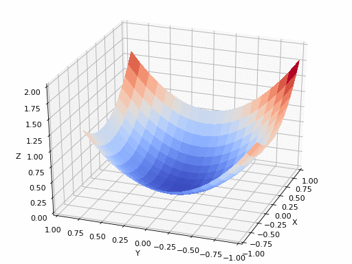
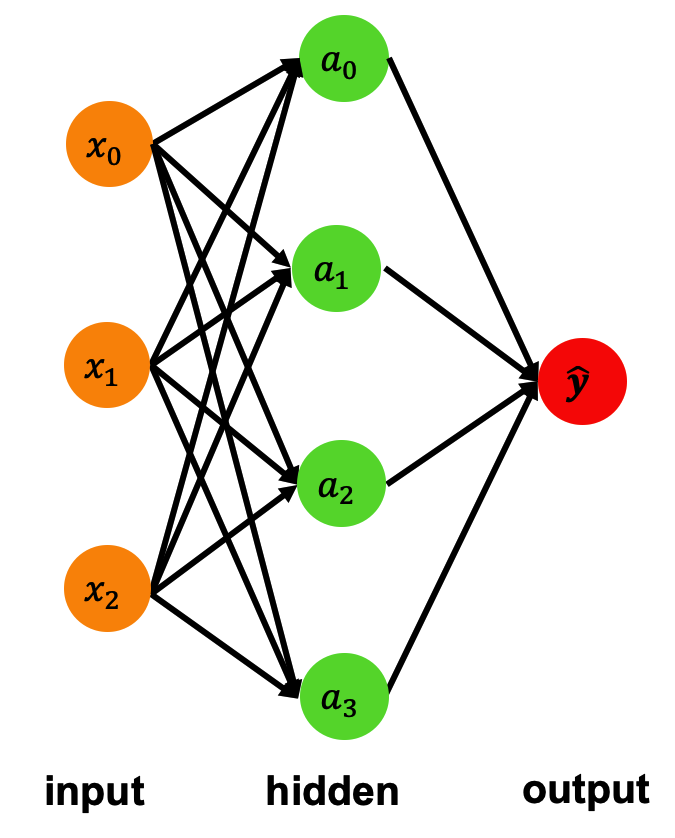
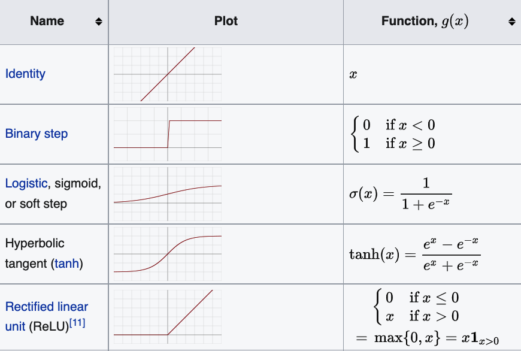

# Regression Models

We learned in [Introduction section](1-intro.md) that regression is to predict continuous values, and the objective of machine learning is the function or model $f(x)$, as shown in figure below.

The model $f(x)$ can also be represented as $\hat{y}(w, x)$, where $x$ is input features and $w$ is weights or parameters.

Machine learning is meant to choose proper weights $w$ with [optimization algorithm](https://en.wikipedia.org/wiki/Mathematical_optimization) (learning algorithm) so that the target $\hat{y}(w, x)$ is close to real values in training examples. The "error" or "cost" between real values and predicted values is presented with [loss function](https://en.wikipedia.org/wiki/Loss_function). Then the goal of machine learning becomes minimizing the "error", i.e. loss function $J(w)$, with respect to weights $w$:

$$ \color{red} \text{Goal:  } \underset{w}{\text{minimize }} J(w)$$

In this section, we'll learn two regression model — the ordinary least squares for linear regression and neural network for non-linear regression — as well as related loss function and optimization algorithms.

## Ordinary Least Squares (linear regression)

Linear here means that the target value is expected to be a linear combination of the input features.

### Model representation

The model of linear regression is
$$\hat{y}(w,x) = w_0 + w_1x_1 + w_2x_2 + \cdots + w_nx_n \$$
where $\hat{y}$ is the target value, vector $X = (x_1, \cdots, x_n)$ are input features and $W = (w_0, \cdots, w_n)$ are weights. weight $w_0$ is also called intercept, and the other weights $(w_1, \cdots, w_n)$ are coefficients.

If there is only one input feature, the model becomes
$$\hat{y}(w,x) = w_0 + w_1x_1$$
it's also called univariate linear regression.

### Loss function

Loss function is to measure the "error" between real values and predicted values. For regression, it can be presented as the following form:

$$ J(w) = ||y - \hat{y}||^2 $$

which is the sum of squares of the differences between real values $y$ and predicted values $\hat{y}$.

### Optimization algorithm

Optimization algorithm is the algorithms used to minimize the loss function, i.e. to keep changing weights $w$ to reduce loss $J(w)$ until it hopefully ends up at a minimum.

The most basic and popular optimization algorithm is [gradient descent](https://en.wikipedia.org/wiki/Gradient_descent), also known as steepest descent. It can be described as below:

$$ \color{gray} \text{repeat until convergence: } \\
     \color{black} w_i := w_i - \alpha\frac{\partial{}}{\partial{w}}J(w) \\
    \color{gray}
    \text{for } i = (0, \cdots, n) \\
    \alpha \text{ is learning rate}
$$

The basic idea is to take repeated steps in the opposite direction of the gradient of the loss function, i.e. $\displaystyle -\frac{\partial{}}{\partial{w}}J(w)$, which will lead to a local minimum of loss function, as shown below.

<!-- Figure Gradient-descent.png from https://imaddabbura.github.io/img/gradient-descent-algorithms/gradients.PNG -->

The process of gradient descent for two features would look like the dynamic diagram below:

<!-- Figure Gradient_descent_dynamic.gif from https://blog.paperspace.com/intro-to-optimization-in-deep-learning-gradient-descent/ -->

## Neural network (non-linear regression)

### Model representation

The diagram demonstrates one hidden layer neural network.

<!-- Text from https://scikit-learn.org/stable/modules/neural_networks_supervised.html#multi-layer-perceptron -->
The input layer consists of a set of neurons representing the input features.

 Each neuron in the hidden layer transforms the values from the previous layer with a weighted linear summation $w_1x_1 + w_2x_2 + \cdots + w_nx_n$, followed by a non-linear activation function, e.g. the [logistic or sigmoid function](https://en.wikipedia.org/wiki/Sigmoid_function).

 The output layer receives the values from the last hidden layer and transforms them into output values with linear function.

Neural network models look like what this diagram present, with more input features and more hidden layers.

Want to play with presentation of neural network? Try https://alexlenail.me/NN-SVG/index.html.

#### Activation function
Various activation functions are available in `scikit-learn`, e.g. identity, logistic, tanh and relu. Take a look at [this table](https://en.wikipedia.org/wiki/Activation_function#Table_of_activation_functions) to know more about these functions.

<!-- Table is from https://en.wikipedia.org/wiki/Activation_function#Table_of_activation_functions -->

### Loss function
Loss function can be shared by all regression models, so loss function $J(w) = ||y - \hat{y}||^2$ is also used for neural network model.

### Optimization algorithms

 Neural network also use gradient descent as [optimization algorithm](https://scikit-learn.org/stable/modules/neural_networks_supervised.html#algorithms). More precisely, [stochastic gradient descent](https://en.wikipedia.org/wiki/Stochastic_gradient_descent)(SGD) is used.

 The difference of SGD with regular gradient descent is that SGD replaces the actual gradient (calculated from the entire training data) by an estimate (calculated from a randomly selected subset of the training data). More details about SGD can be found in [scikit-learn guide](https://scikit-learn.org/stable/modules/sgd.html).

[Adam](https://en.wikipedia.org/wiki/Stochastic_gradient_descent#Adam)(Adaptive Moment Estimation) is also a stochastic optimizer, but it can automatically adjust the amount to update weights. It works great on large datasets (thousands of training samples or more) in terms of both training time and validation score, and `scikit-learn` use it as default.

[Backpropagation](https://en.wikipedia.org/wiki/Backpropagation) is not a optimization algorithm but a method to compute gradients for neural network. Then these gradients are used by optimization algorithm to update weights.
