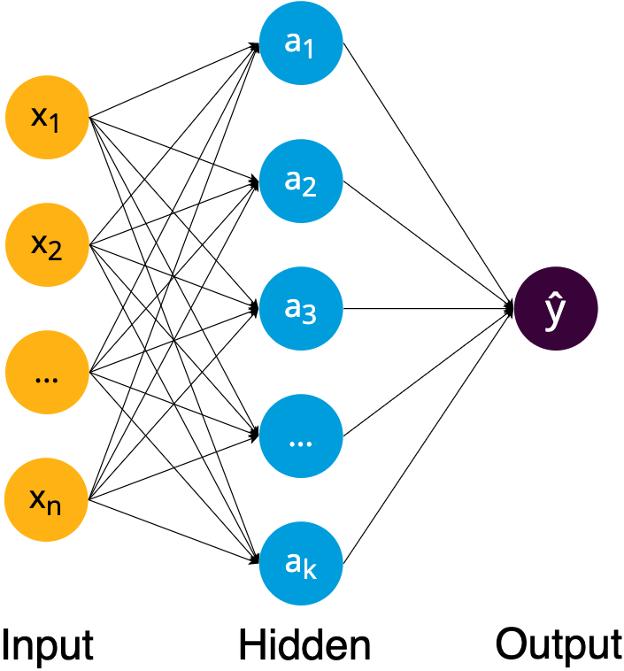

# Regression Models

We learned in [Introduction section](1-intro.md) that regression is to predict continuous values, and the objective of machine learning is the function or model $f(x)$, as shown in figure below.

The model $f(x)$ can also be represented as $\hat{y}(w, x)$, where $x$ is input features and $w$ is weights or parameters.

Machine learning is meant to choose proper weights $w$ with an [optimization algorithm](https://en.wikipedia.org/wiki/Mathematical_optimization) (learning algorithm) so that the target $\hat{y}(w, x)$ is close to real values in training examples. The "error" or "cost" between real values and predicted values is presented with [loss function](https://en.wikipedia.org/wiki/Loss_function). Then the goal of machine learning becomes minimizing the "error", i.e. loss function $J(w)$, with respect to weights $w$:

$$ \color{red} \text{Goal:  } \underset{w}{\text{minimize }} J(w)$$

In this section, we'll learn two regression model — the ordinary least squares for linear regression and neural network for non-linear regression — as well as related loss function and optimization algorithms.

## Ordinary Least Squares (linear regression)

Linear here means that the target value is expected to be a linear combination of the input features.

### Model representation

Let's say we have house price as target value, and the house price is expected to be linearly increased with house area. Then we could use a linear model to capture this relationship, as shown in the diagram below:

This linear model could be represented as
$$\hat{y}(w,x) = w_0 + w_1x_1$$

Here $\hat{y}$ is the target value, i.e. house price,  we have only one input feature or variable $x_1$, i.e. house area, $w_0, w_1$ are the weights.

Linear regression with one input feature is also called univariate linear regression.

When we have more input features, e.g. number of bedrooms, area of balcony, construction year, etc., the model of linear regression becomes
$$\hat{y}(w,x) = w_0 + w_1x_1 + w_2x_2 + \cdots + w_nx_n \$$
where $\hat{y}$ is the target value, vector $X = (x_1, \cdots, x_n)$ are input features and $W = (w_0, \cdots, w_n)$ are weights. weight $w_0$ is also called intercept, and the other weights $(w_1, \cdots, w_n)$ are coefficients.

### Loss function

Suppose we have a linear model with certain values for the weights. How well does this model capture the data that we observe?

We can come up with a **loss function** that measures the "error" between real values and predicted values. For regression, we can for example calculate the squares of the differences between real and predicted points:

$$ J(w) = ||y - \hat{y}||^2 $$

which is the sum of squares of the differences between real values $y$ and predicted values $\hat{y}$.

### Optimization algorithm

Now that we have defined a loss function, we want to choose the weights so that the loss is as small as possible. We do this with an **optimization algorithm**: an algorithm used to minimize the loss function, i.e. to keep changing weights $w$ to reduce loss $J(w)$ until it hopefully ends up at a minimum.

The most basic and popular optimization algorithm is [gradient descent](https://en.wikipedia.org/wiki/Gradient_descent), also known as steepest descent.

The basic idea is to take repeated steps in the opposite direction of the gradient of the loss function, i.e. $\displaystyle \nabla{_wJ} = \frac{\partial{}}{\partial{w}}J(w)$, which will lead to a local minimum of loss function, as shown below.

<!-- Figure Gradient-descent.png from https://imaddabbura.github.io/img/gradient-descent-algorithms/gradients.PNG -->

The process of gradient descent for two features would look like the dynamic diagram below:

<!-- Figure Gradient_descent_dynamic.gif from https://blog.paperspace.com/intro-to-optimization-in-deep-learning-gradient-descent/ -->

 As a reference, the gradient descent can be exactly described as below:

$$ \color{gray} \text{repeat until convergence: } \\
     \color{black} w_i := w_i - \alpha\frac{\partial{}}{\partial{w}}J(w) \\
    \color{gray}
    \text{for } i = (0, \cdots, n) \\
    \alpha \text{ is learning rate}
$$

## Ensemble methods
Decision trees, as we were introduced for classification, can also be used for regression. We assign the *mean* of the scores of the items in a leaf. 
However, we also saw that decision trees are prone to overfitting. Small variations in the data lead to completely different trees.

### Random forest
A forest is a collection of trees. Each of the trees is trained on a random sample of *features* and a random sample of *data items*. The prediction is the *average* of all individual predictions.

This makes the model more robust than a single tree.

### Boosting
There are also other types of 'ensemble models'. In *boosting*, you give more weight to data points that were difficult to predict by previous models in the ensemble.

**Tip**: look into the `HistGradientBoostingClassifier` and `HistGradientBoostingRegressor` in sklearn. They are fast, handle missing data automatically and often work well! 

## Neural network (non-linear regression)

### Model representation

The diagram demonstrates one hidden layer neural network.

**The input layer** consists of a set of neurons representing the input features.

**The hidden layer**:
<!-- Text and fig from https://github.com/carpentries-incubator/deep-learning-intro/blob/gh-pages/_episodes/01-introduction.md -->

Each neuron
- has one or more inputs, e.g. input data expressed as floating point numbers
- most of the time, each neuron conducts 3 main operations:
  + take the weighted sum of the inputs
  + add an extra constant weight (i.e. a bias term) to this weighted sum
  + apply a non-linear function to the output so far (using a predefined activation function, e.g. the [logistic or sigmoid function](https://en.wikipedia.org/wiki/Sigmoid_function))
- return one output value, again a floating point number

**The output layer** receives the values from the last hidden layer and transforms them into output values with linear function.

The neural network available in `scikit-learn` is just look like the architecture in the diagram, i.e. multi-layer perceptron. To use more complex neural network models, deep learning framework should be used, e.g. [PyTorch, Keras, TensorFlow, etc](https://en.wikipedia.org/wiki/Comparison_of_deep_learning_software). Want to have a look at various neural network models? Try https://alexlenail.me/NN-SVG/index.html.

#### Activation function
[Activation function](https://en.wikipedia.org/wiki/Activation_function) is also called transfer function. Commonly used non-linear activation functions `logistic`, `tanh` and `relu` are available in `scikit-learn`. In practice, use the default `relu` is good enough.

<!-- Table is from https://en.wikipedia.org/wiki/Activation_function#Table_of_activation_functions -->

#### Benefits and drawbacks of NN over linear regression

The design of the neural network, with it's non-linearity and layers stacked on top of each other, allows for much more complex patterns to be detected than with linear regression. We can view the neurons as *feature detectors*, that retrieve relevant pieces of information from the input data. The flipside of the coin, is that often we need large amounts of training data to be able to learn these features.

### Loss function
Loss function can be shared by all regression models, so loss function $J(w) = ||y - \hat{y}||^2$ is also used for neural network model.

### Optimization algorithms

 Neural network also use gradient descent as [optimization algorithm](https://scikit-learn.org/stable/modules/neural_networks_supervised.html#algorithms).

 More precisely, [stochastic gradient descent](https://en.wikipedia.org/wiki/Stochastic_gradient_descent)(SGD) is used. The difference of SGD with regular gradient descent is that SGD replaces the actual gradient (calculated from the entire training data) by an estimate (calculated from a randomly selected subset of the training data). More details about SGD can be found in [scikit-learn guide](https://scikit-learn.org/stable/modules/sgd.html).

[Adam](https://en.wikipedia.org/wiki/Stochastic_gradient_descent#Adam)(Adaptive Moment Estimation) is also a stochastic optimizer, but it can automatically adjust the amount to update weights. It works great on large datasets (thousands of training samples or more) in terms of both training time and validation score, and `scikit-learn` use it as default. It's recommended to use `Adam` as the first choice in practice.

[Backpropagation](https://en.wikipedia.org/wiki/Backpropagation) is not a optimization algorithm but a method to compute gradients for neural network. Then these gradients are used by optimization algorithm to update weights.
