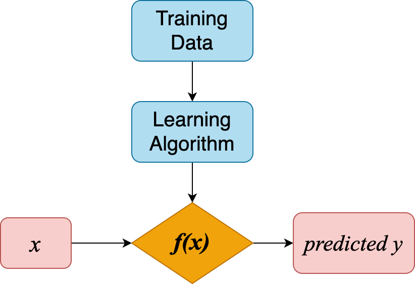
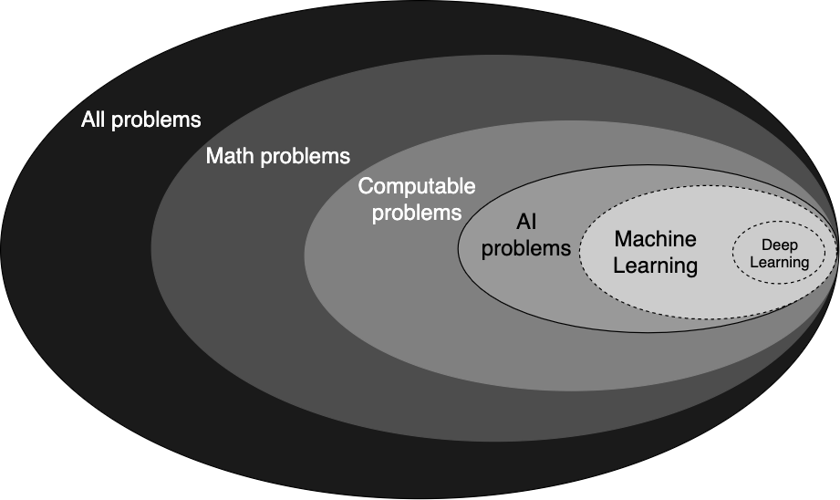
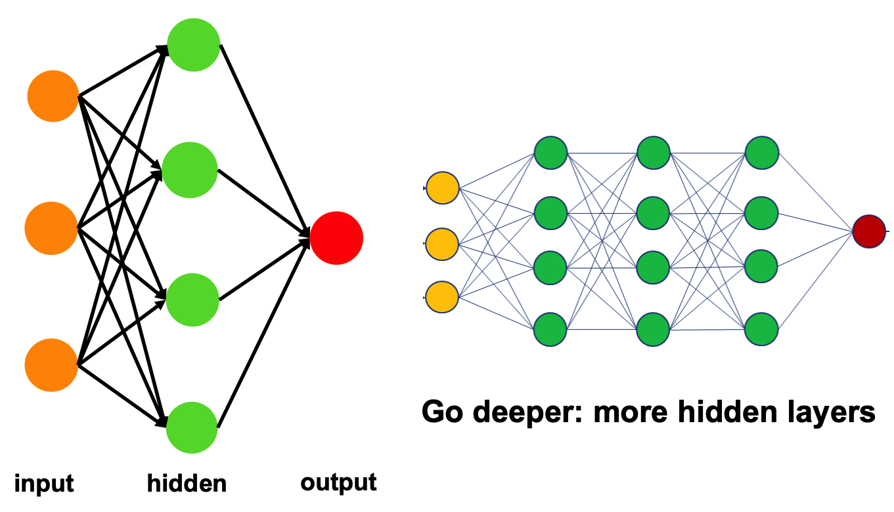

<!-- Author: Cunliang Geng -->
<!-- Note: the commented lines are reference material -->

- [Introduction to machine learning](#introduction-to-machine-learning)
  - [What is machine learning](#what-is-machine-learning)
  - [Machine learning and artificial intelligence](#machine-learning-and-artificial-intelligence)
  - [Machine learning and statistics](#machine-learning-and-statistics)
  - [Types of machine learning](#types-of-machine-learning)
    - [Supervised learning](#supervised-learning)
      - [Classification](#classification)
      - [Regression](#regression)
    - [Unsupervised learning](#unsupervised-learning)
    - [Reinforcement learning](#reinforcement-learning)
  - [Limitations of machine learning](#limitations-of-machine-learning)
    - [Data](#data)
    - [Extrapolation](#extrapolation)
    - [Interpretation of Results](#interpretation-of-results)
  - [Machine learning glossary](#machine-learning-glossary)

# Introduction to machine learning

## What is machine learning

**An informal definition by [Arthur Samuel](https://en.wikipedia.org/wiki/Arthur_Samuel)**
> The field of study that gives computers the ability to learn without being explicitly programmed.

The focus of machine learning (ML) is "learning". A learning problem is about learning some properties of examples (training data) and then predicting those properties against other unseen data.

**A modern definition by [Tom Mitchell](https://en.wikipedia.org/wiki/Tom_M._Mitchell)**
> A computer program is said to learn from experience E with respect to some class of tasks T and performance measure P, if its performance at tasks in T, as measured by P, improves with experience E.

Linking to the first definition, the experience E is actually the examples or training data, task T is the learning problem, and performance P is how well the computer program performs on task T when giving unknown data.

For example,
- predicting house price:
  - E = the historical price of many houses
  - T = the task of predicting house price
  - P = the performance is how exactly the program predict the house price
- playing Go:
  - E = the experience of playing many games of Go
  - T = the task of playing Go
  - P = the probability that the program will win the next Go

**The mathematical perspective:**

The objective of ML is the function $f(x)$:
$$ \hat{y} = f(x) $$

The learning is to apply specific algorithms (learning algorithms) to training data to get the exact form of the function $f(x)$. The learned function or model $f(x)$ can then be used to predict property $\hat{y}$ for input data $x$.

The form of function $f(x)$ could be simple, e.g. linear function, or complex, e.g. non-linear function.

<!-- fig1.1 adapted from https://www.coursera.org/learn/machine-learning  -->

## Machine learning and artificial intelligence

<!-- fig1.2 adapted from book of Wu, Jun. The Beauty of Mathematics in Computer Science. -->
<!-- https://www.ibm.com/cloud/learn/what-is-artificial-intelligence -->

Let's treat all problems in the universe as a set. This set can be divided to mathematical problems and other problems (e.g. love problems, moral and ethical problems, cultural conflict problems and so on).

Some of mathematical problems are [computable](https://en.wikipedia.org/wiki/Computability), which means it can be solved in principle by a computing machine, while the other are not.

[AI](https://en.wikipedia.org/wiki/Artificial_intelligence) is a subgroup of computable problems. It tries to make intelligent machines, especially intelligent computer programs. It also means computability is the limit of AI. AI cannot do everything, cannot solve the problems that is not computable.

AI problems or goals include e.g problem-solving, reasoning, planning, learning, communicating, acting, etc. There are various algorithms that try to solve these AI problems.

ML is a subgroup of these AI algorithms which seek to enable machine to learn from examples in order to make predictions based on input data.
ML is comprised of classical algorithms and deep learning (DL) algorithms. Classical ML algorithms include, e.g. linear regression, decision trees, support vector machine, etc.

Deep learning is a specific group of algorithms that are based on artificial neural networks. “Deep” in deep learning refers to a neural network comprised of more than three layers, which would be inclusive of the inputs and the output.

<!-- https://www.ibm.com/cloud/learn/what-is-artificial-intelligence -->
Classical ML algorithms and DL differ in how each algorithm learns. Deep learning automates much of the feature extraction piece of the process, eliminating some of the manual human intervention required and enabling the use of larger data sets. Classical machine learning is more dependent on human intervention to learn. Human experts determine the hierarchy of features to understand the differences between data inputs, usually requiring more structured data to learn.

## Machine learning and statistics

<!-- https://www.nature.com/articles/nmeth.4642 -->
<!-- https://en.wikipedia.org/wiki/Machine_learning#Statistics -->
Machine learning and statistics are closely related fields in terms of methods, but distinct in their principal goal: statistics draws population inferences from a sample, while machine learning finds generalizable predictive patterns.

<!-- https://machinelearningmastery.com/types-of-learning-in-machine-learning/ -->
## Types of machine learning

There are three main types of learning problems in machine learning: supervised, unsupervised, and reinforcement learning.

### Supervised learning

Supervised learning describes a type of problem that enables computer to learn a mapping between input examples and the target variable. The training data comes with the target variable that we want to predict, we call it labeled data.

#### Classification
<!-- https://scikit-learn.org/stable/tutorial/basic/tutorial.html#machine-learning-the-problem-setting -->

As for classification, its target variable is discrete. The target belongs to two or more classes and we want to learn from already labeled data how to predict the class of unlabeled data.

An example of a classification problem would be handwritten digit recognition, in which the aim is to assign each input vector to one of a finite number of discrete categories.

#### Regression
<!-- https://scikit-learn.org/stable/tutorial/basic/tutorial.html#machine-learning-the-problem-setting -->

Regression's target variable is continuous. An example of a regression problem would be the prediction of the length of a salmon as a function of its age and weight.

### Unsupervised learning
<!-- https://scikit-learn.org/stable/tutorial/basic/tutorial.html#machine-learning-the-problem-setting -->

Unsupervised learning describes a type of problem that enables computer to describe or extract relationships in data. The training data is unlabelled data, i.e. there is no value of target variable in the training data.

The goal in such problems may be
- to discover groups of similar examples within the data, where it is called **clustering**,
- to determine the distribution of data within the input space, known as **density estimation**,
- to project the data from a high-dimensional space down to two or three dimensions, i.e. **dimensionality reduction**

### Reinforcement learning
<!-- https://machinelearningmastery.com/types-of-learning-in-machine-learning/ -->
Reinforcement learning describes a type of problem where an agent operates in an environment and must learn to operate using feedback.

The use of an environment means that there is no fixed training dataset, rather a goal or set of goals that an agent is required to achieve, actions they may perform, and feedback about performance toward the goal.

An example of reinforcement learning is Google’s AlphaGo.

<!-- https://github.com/esciencecenter-digital-skills/machine-learning-material/blob/main/notebooks/1-Intro.ipynb -->
**Exercise: Supervised or unsupervised**

For the following problems, do you think you need a supervised or unsupervised approach?

- Find numerical representations for words in a language (word vectors) that contain semantic information on the word
- Determine whether a tumor is benign or malign, based on an MRI-scan
- Predict the age of a patient, based on an EEG-scan
- Cluster observations of plants into groups of individuals that have similar properties, possibly belonging to the same species
- Your own problem and dataset

## Limitations of machine learning
<!-- https://carpentries-incubator.github.io/machine-learning-novice-sklearn/01-introduction/index.html -->

### Data
Machine Learning requires massive data to train on. These data should be unbiased and of good quality, which are not easy to get in practice.

### Extrapolation
We can only make reliable predictions about data which is in the same range as our training data. If we try to extrapolate beyond what was covered in the training data we’ll probably get wrong answers.

### Interpretation of Results
It's a challenge to accurately interpret results generated by the algorithms. You have to carefully choose the algorithms for your purpose.

## Machine learning glossary

Here are some resources about ML glossary
- https://developers.google.com/machine-learning/glossary
- https://scikit-learn.org/stable/glossary.html