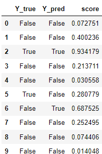

# Performance metrics

## Confusion matrix

Suppose we have this confusion matrix:

Note that the majority class is "No BBQ".

In machine learning jargon, when we have binary classification we speak about 'positive' and 'negative' classes. 
It is a bit arbitrary which class you choose as positive, but generally speaking it's the class you're most interested in to predict well. We are interested in nice BBQ weather, so this is our 'positive' class.

## TP,TN,FP,FN

Then we define:
- **T**rue **P**ositives: Positive in reality, prediction positive
- **T**rue **N**egatives: Negative in reality, prediction negative
- **F**alse **P**ositives: Negative in reality, prediction positive
- **F**alse **N**egatives: Positive in reality, prediction negative

## Accuracy
*Accuracy* is the rate of correct predictions:
`acc = (TP+TN) / (TP+TN+FN+FP)`.

In our case:
`acc = (70 + 15) / 100 = 0.85`
Note that this score gets skewed by the majority class!

## Precision and recall
If we look from the perspective of the 'positive' class, we can define:
- Precision: How many of the predicted BBQ days can we truly fire our BBQ?
- Recall: How many of the true BBQ days were predicted by the model?

In math:
- `prec = TP / (TP + FP) = 15 / (15+10) = 0.6`
- `rec = TP / (TP + FN) = 15 / (15+5) = 0.75`
Note how these scores are lower than the precision. The model is not doing so well on our class of interest.

## f1

Often you want both precision and recall to be high. We can calculate the f1 score:
`f1 = 2 x precision x recall / (precision + recall)`

(Note: this is a 'harmonic mean', which gives more weight to low values compared to regular mean. so it's only high when both values are high).

## Trade-off Precision/recall

For most models, we do not just get the predicted class, but also an associated *score*. If the score is above a certain threshold, it assigns that class.

## Exercise

**Exercise**: what do you think happens with the precision and recall when we increase or decrease the threshold?

## Solution

If we **increase** the threshold, we get more strict: recall drops, precision may improve (if our model does well).
If we **decrease** the threshold, our recall may increase but precision could drop.

We can plot the precision and recall against the thresholds:

