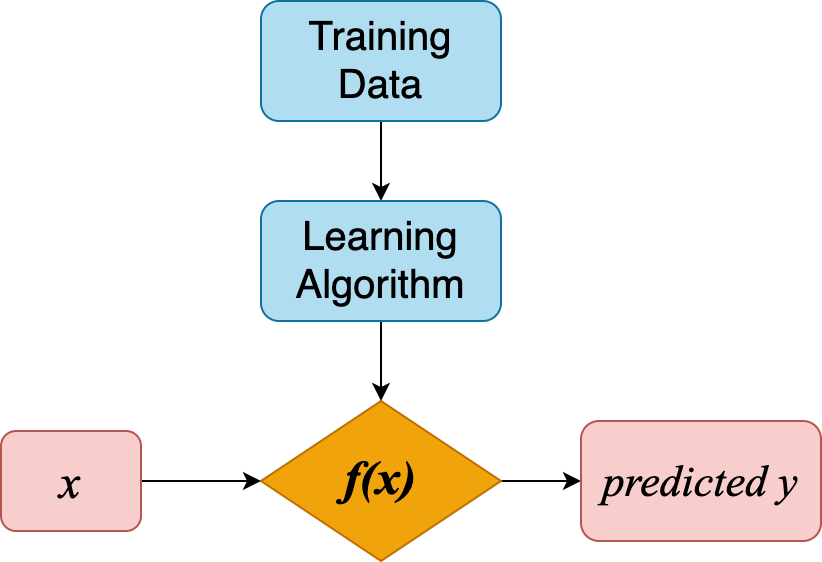
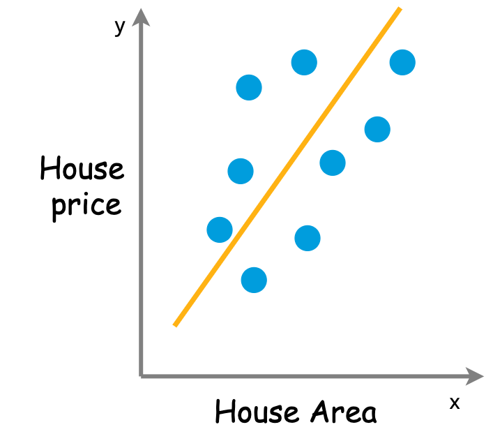

# Intro
## ML Goal

{height=300px}

$$ f(x) = \hat{y}(w, x) $$

- $x$ is input features
- $w$ is weights or parameters

::: notes
We learned in [Introduction section](1-introduction.md) that regression is to predict continuous values, and the objective of machine learning is the function or model $f(x)$, as shown in figure below.

The model $f(x)$ can also be represented as $\hat{y}(w, x)$, where $x$ is input features and $w$ is weights or parameters.
:::

---

ML is meant to

- make the target $\hat{y}(w, x)$ as close as possible to real values in training data
- by choosing proper weights $w$
  - with [optimization algorithm](https://en.wikipedia.org/wiki/Mathematical_optimization)

::: fragment
- the "error" or "cost" between real values and predicted values is presented with [loss function](https://en.wikipedia.org/wiki/Loss_function)
:::

---

Then ML goal becomes

**minimizing loss function $J(w)$**

with respect to weights $w$

---

## We'll learn

- Ordinary least squares (linear regression)
- Neural network (non-linear regression)
- Loss function and optimization algorithms

::: notes
In this section, we'll learn two regression model — the ordinary least squares for linear regression and neural network for non-linear regression — as well as related loss function and optimization algorithms.
:::

# Ordinary Least Squares (linear regression)
## Model representation

{height=300px}

::: fragment
$$\hat{y}(w,x) = w_0 + w_1x_1$$
:::

::: fragment
*univariate linear regression*
:::

::: notes
Let's say we have house price as target value, and the house price is expected to be linearly increased with house area. Then we could use a linear model to capture this relationship, as shown in the diagram.

Here $\hat{y}$ is the target value, i.e. house price,  we have only one input feature or variable $x_1$, i.e. house area, $w_0, w_1$ are the weights.

Linear regression with one input feature is also called univariate linear regression.
:::

---

When we have more input features, e.g. number of bedrooms, area of balcony, construction year, etc.

::: fragment
The model becomes
$$ \hat{y} (w,x) = w_0 + w_1 x_1 + w_2 x_2 + \cdots + w_n x_n $$
:::

::: fragment
- $\hat{y}$ is the target value
- $X = (x_1, \cdots, x_n)$ are input features
- $W = (w_0, \cdots, w_n)$ are weights
  - weight $w_0$ is also called intercept
  - and the other weights $(w_1, \cdots, w_n)$ are coefficients.
:::

## Loss function

We have a linear model with certain values for the weights. How well does this model capture the data that we observe?

::: fragment
We could use loss function

$$ J(w) = ||y - \hat{y}||^2 $$

 the sum of squares of the differences between real values $y$ and predicted values $\hat{y}$
:::

::: notes
We can come up with a **loss function** that measures the "error" between real values and predicted values.

For regression, we can for example calculate the squares of the differences between real and predicted points

The squares in the "Ordinary Least Squares" comes from this loss function.
:::

## Optimization algorithm

Do you still remember the ML goal?

::: fragment
**minimize loss function $J(w)$**
:::

::: fragment
This is done by **optimization algorithm**:

keep changing weights $w$ to reduce loss $J(w)$ until it hopefully ends up at a minimum
:::

::: notes
Now that we have defined a loss function, we want to choose the weights so that the loss is as small as possible.

We do this with an **optimization algorithm**: an algorithm used to minimize the loss function,

i.e. to keep changing weights $w$ to reduce loss $J(w)$ until it hopefully ends up at a minimum.
:::

---

[Gradient Descent](https://en.wikipedia.org/wiki/Gradient_descent)

<!-- Figure Gradient-descent.png from https://imaddabbura.github.io/img/gradient-descent-algorithms/gradients.PNG -->

::: notes
The most basic and popular optimization algorithm is [gradient descent](https://en.wikipedia.org/wiki/Gradient_descent), also known as steepest descent.

The basic idea is to take repeated steps in the opposite direction of the gradient of the loss function, i.e. $\displaystyle \nabla{_wJ} = \frac{\partial{}}{\partial{w}}J(w)$, which will lead to a local minimum of loss function, as shown below.
:::

---

Gradient descent for two features:

<!-- Figure Gradient_descent_dynamic.gif from https://blog.paperspace.com/intro-to-optimization-in-deep-learning-gradient-descent/ -->

::: notes
As a reference, the gradient descent can be exactly described as below:

$$ \color{gray} \text{repeat until convergence: } \\
     \color{black} w_i := w_i - \alpha\frac{\partial{}}{\partial{w}}J(w) \\
    \color{gray}
    \text{for } i = (0, \cdots, n) \\
    \alpha \text{ is learning rate}
$$
:::

## Summary:

Linear regression

- Model presentation: $\hat{y} (w,x) = w_0 + w_1 x_1 + \cdots + w_n x_n$
- Loss function: $J(w) = ||y - \hat{y}||^2$
- Optimization algorithm: Gradient Descent

# Neural network (non-linear regression)
## Model representation

{height=500px}

::: notes
The diagram demonstrates one hidden layer neural network.

**The input layer** consists of a set of neurons representing the input features.

**The output layer** receives the values from the last hidden layer and transforms them into output values with linear function.
:::

---

### Hidden layer

::: notes
<!-- Text and fig from https://github.com/carpentries-incubator/deep-learning-intro/blob/gh-pages/_episodes/01-introduction.md -->

Each neuron

- has one or more inputs, e.g. input data expressed as floating point numbers
- most of the time, each neuron conducts 3 main operations:
  + take the weighted sum of the inputs
  + add an extra constant weight (i.e. a bias term) to this weighted sum
  + apply a non-linear function to the output so far (using a predefined activation function, e.g. the [logistic or sigmoid function](https://en.wikipedia.org/wiki/Sigmoid_function))
- return one output value, again a floating point number

Question: what is the difference with linear model?
:::

---

### Activation function

<!-- Table is from https://en.wikipedia.org/wiki/Activation_function#Table_of_activation_functions -->

::: notes
[Activation function](https://en.wikipedia.org/wiki/Activation_function) is also called transfer function. Commonly used non-linear activation functions `logistic`, `tanh` and `relu` are available in `scikit-learn`. In practice, use the default `relu` is good enough.
:::

## Loss function
Loss function can be shared by all regression models

$$J(w) = ||y - \hat{y}||^2$$

## Optimization algorithms

::: fragment
[Stochastic Gradient Descent](https://en.wikipedia.org/wiki/Stochastic_gradient_descent)(SGD)

- GD uses actual gradient, calculated from the entire training data
- SGD use an estimate calculated from a randomly selected subset of the training data
:::

::: notes
Neural network also use gradient descent as [optimization algorithm](https://scikit-learn.org/stable/modules/neural_networks_supervised.html#algorithms).

More details about SGD can be found in [scikit-learn guide](https://scikit-learn.org/stable/modules/sgd.html).
:::

---

[Adam](https://en.wikipedia.org/wiki/Stochastic_gradient_descent#Adam)(Adaptive Moment Estimation)

- also a stochastic optimizer
- but can automatically adjust the amount to update weights
- works great on large datasets (thousands of training samples or more) in terms of both training time and validation score
- Use `Adam` as the first choice in practice

---

[Backpropagation](https://en.wikipedia.org/wiki/Backpropagation)

- not a optimization algorithm
- but a method to compute gradients for neural network. Then these gradients are used by optimization algorithm to update weights.

##

### NN v.s. linear regression

::: incremental
- NN stacked layers and non-linearity → detect more complex patterns
- Neurons is kind of *feature extractor*
- However, NN requires large amount of data to detect the patterns and extract the features
:::

::: notes
The design of the neural network, with it's non-linearity and layers stacked on top of each other, allows for much more complex patterns to be detected than with linear regression.

We can view the neurons as *feature detectors*, that retrieve relevant pieces of information from the input data.

The flipside of the coin, is that often we need large amounts of training data to be able to learn these features.
:::
---

### Deep learning frameworks

 `scikit-learn`  NN model is multi-layer perceptron

To use more complex NN, other framework should be used, e.g. [PyTorch, Keras, TensorFlow, etc](https://en.wikipedia.org/wiki/Comparison_of_deep_learning_software).

::: fragment
Want to have a look at various NN models? Try [plot NN](https://alexlenail.me/NN-SVG/index.html)
:::

## Summary:

Neural network

- Model presentation: multi-layer perceptron
- Loss function: $J(w) = ||y - \hat{y}||^2$
- Optimization algorithm: SGD, ADAM

# Thank you {background-image="image/e-end1.png"}
## Q&A {background-image="image/e-end1.png"}

::: notes
**Ensemble methods**
Decision trees, as we were introduced for classification, can also be used for regression. We assign the *mean* of the scores of the items in a leaf.
However, we also saw that decision trees are prone to overfitting. Small variations in the data lead to completely different trees.

**Random forest**
A forest is a collection of trees. Each of the trees is trained on a random sample of *features* and a random sample of *data items*. The prediction is the *average* of all individual predictions.

This makes the model more robust than a single tree.

**Boosting**
There are also other types of 'ensemble models'. In *boosting*, you give more weight to data points that were difficult to predict by previous models in the ensemble.

**Tip**: look into the `HistGradientBoostingClassifier` and `HistGradientBoostingRegressor` in sklearn. They are fast, handle missing data automatically and often work well!
:::